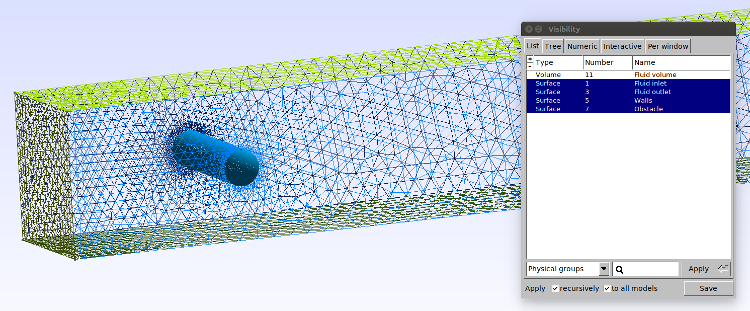

# Using the GMSH Python API to generate complex meshes
In this tutorial, we will use the gmsh API to generate complex meshes. We will in this tutorial learn how to make the 3D mesh used in the [DFG 3D laminar benchmark](http://www.featflow.de/en/benchmarks/cfdbenchmarking/flow/dfg_flow3d.html). The [first part](first) of this tutorial can be completed with the `dokken92/pygmsh-6.1.1` docker images, as described in the [pygmsh tutorial](converted_files/tutorial_pygmsh.md). For the [second](second) and [third](third) part of the tutorial, `dolfinx` is required. You can obtain a jupter-lab image with `dolfinx/lab` and a normal docker image with `dolfinx/dolfinx`.

This tutorial can be downloaded as a [Python-file](../converted_files/tutorial_gmsh.py) or as a [Jupyter notebook](../notebooks/tutorial_gmsh.ipynb).

## <a name="first"></a> 1. How to create a 3D mesh with physical tags with the GMSH python API.
We start by import the gmsh module, and initializing the Python API. **NOTE:** This has to be done in order to run any function in the GMSH API.


```python
import gmsh
gmsh.initialize()
```

The next step is to create the rectangular channel of the benchmark. In GMSH, there are two kernels for geometry computations; the `built_in` kernel ( `gmsh.model.geo`), and the [OpenCascade](https://www.opencascade.com/) kernel (`gmsh.model.opencascade`). In this tutorial, we will use the the `occ` kernel, as it is better suited. Other demos of the usage of the gmsh python API can be found in their [GitLab repository](https://gitlab.onelab.info/gmsh/gmsh/-/tree/master/tutorial/python).


```python
gmsh.model.add("DFG 3D")
L, B, H, r = 2.5, 0.41, 0.41, 0.05
channel = gmsh.model.occ.addBox(0, 0, 0, L, B, H)
```

The next step is to create the cylinder, which is done in the following way


```python
cylinder = gmsh.model.occ.addCylinder(0.5, 0,0.2,0, B, 0, r)
```

where the first three arguments describes the (x,y,z) coordinate of the center of the first circular face. The next three arguments describes the axis of height of the cylinder, in this case, it is (0,0.41,0). The final parameter is the radius of the cylinder.
We have now created two geometrical objects, that each can be meshed with GMSH. However, we are only interested in the fluid volume in the channel, which whould be the channel excluding the sphere. We use the GMSH command `BooleanDifference` for this


```python
fluid = gmsh.model.occ.cut([(3, channel)], [(3, cylinder)])
```

where the first argument `[(3, channel)]`is a list of tuples, where the first argument is the geometrical dimension of the entity (Point=0, Line=1, Surface=2, Volume=3). and channel is a unique integer identifying the channel. Similarly, the second argument is the list of tuples of entities we would like to exclude from 
the newly created fluid volume.
The next step is to tag physical entities, such as the fluid volume, and inlets, outlets, channel walls and obstacle walls.
We start by finding the volumes, which after the `cut`-operation is only the fluid volume. We could have kept the other volumes by supply keyword arguments to the  `cut`operation. See the [GMSH Python API](https://gitlab.onelab.info/gmsh/gmsh/-/blob/master/api/gmsh.py#L5143) for more information. We also need to syncronize the CAD module before tagging entities.


```python
gmsh.model.occ.synchronize()
volumes = gmsh.model.getEntities(dim=3)
assert(volumes == fluid[0])
print(volumes)
fluid_marker = 11
gmsh.model.addPhysicalGroup(volumes[0][0], [volumes[0][1]], fluid_marker)
gmsh.model.setPhysicalName(volumes[0][0], fluid_marker, "Fluid volume")
```

    [(3, 1)]


For the surfaces, we start by finding all surfaces, and then compute the geometrical center such that we can indentify which are inlets, outlets, walls and the obstacle. As the walls will consist of multiple surfaces, and the obstacle is circular, we need to find all entites before addin the physical group.


```python
import numpy as np
surfaces = gmsh.model.occ.getEntities(dim=2)
inlet_marker, outlet_marker, wall_marker, obstacle_marker = 1, 3, 5, 7
walls = []
obstacles = []
for surface in surfaces:
    com = gmsh.model.occ.getCenterOfMass(surface[0], surface[1])
    if np.allclose(com, [0, B/2, H/2]):
        gmsh.model.addPhysicalGroup(surface[0], [surface[1]], inlet_marker)
        inlet = surface[1]
        gmsh.model.setPhysicalName(surface[0], inlet_marker, "Fluid inlet")
    elif np.allclose(com, [L, B/2, H/2]):
        gmsh.model.addPhysicalGroup(surface[0], [surface[1]], outlet_marker)
        gmsh.model.setPhysicalName(surface[0], outlet_marker, "Fluid outlet")
    elif np.isclose(com[2], 0) or np.isclose(com[1], B) or np.isclose(com[2], H) or np.isclose(com[1],0):
        walls.append(surface[1])
    else:
        obstacles.append(surface[1])
gmsh.model.addPhysicalGroup(2, walls, wall_marker)
gmsh.model.setPhysicalName(2, wall_marker, "Walls")
gmsh.model.addPhysicalGroup(2, obstacles, obstacle_marker)
gmsh.model.setPhysicalName(2, obstacle_marker, "Obstacle")
```

The final step is to set mesh resolutions. We will use `GMSH Fields` to do this. One can alternatively set mesh resolutions at points with the command `gmsh.model.occ.mesh.setSize`. We start by specifying a distance field from the obstacle surface


```python
gmsh.model.mesh.field.add("Distance", 1)
gmsh.model.mesh.field.setNumbers(1, "FacesList", obstacles)
```

The next step is to use a threshold function vary the resolution from these surfaces in the following way:
```
LcMax -                  /--------
                     /
LcMin -o---------/
       |         |       |
      Point    DistMin DistMax
```


```python
resolution = r/10
gmsh.model.mesh.field.add("Threshold", 2)
gmsh.model.mesh.field.setNumber(2, "IField", 1)
gmsh.model.mesh.field.setNumber(2, "LcMin", resolution)
gmsh.model.mesh.field.setNumber(2, "LcMax", 20*resolution)
gmsh.model.mesh.field.setNumber(2, "DistMin", 0.5*r)
gmsh.model.mesh.field.setNumber(2, "DistMax", r)

```

We add a similar threshold at the inlet to ensure fully resolved inlet flow


```python
gmsh.model.mesh.field.add("Distance", 3)
gmsh.model.mesh.field.setNumbers(3, "FacesList", [inlet])
gmsh.model.mesh.field.add("Threshold", 4)
gmsh.model.mesh.field.setNumber(4, "IField", 3)
gmsh.model.mesh.field.setNumber(4, "LcMin", 5*resolution)
gmsh.model.mesh.field.setNumber(4, "LcMax", 10*resolution)
gmsh.model.mesh.field.setNumber(4, "DistMin", 0.1)
gmsh.model.mesh.field.setNumber(4, "DistMax", 0.5)
```

We combine these fields by using the minimum field


```python
gmsh.model.mesh.field.add("Min", 5)
gmsh.model.mesh.field.setNumbers(5, "FieldsList", [2, 4])
gmsh.model.mesh.field.setAsBackgroundMesh(5)
```

Before meshing the model, we need to use the syncronize command


```python
gmsh.model.occ.synchronize()
gmsh.model.mesh.generate(3)
```

We can write the mesh to msh to be visualized with gmsh with the following command


```python
gmsh.write("mesh3D.msh")
```

The mesh can be visualized in the GMSH GUI. The figure above visualized the marked facets of the 3D geometry.


In the next tutorials, we will learn two diffferent methods of loading this mesh into dolfin-X

## <a name="second"></a> 2. How to load this mesh into dolfin-X without IO
To be released

## <a name="third"></a> 3. How to load msh files into dolfin-X
To be released
