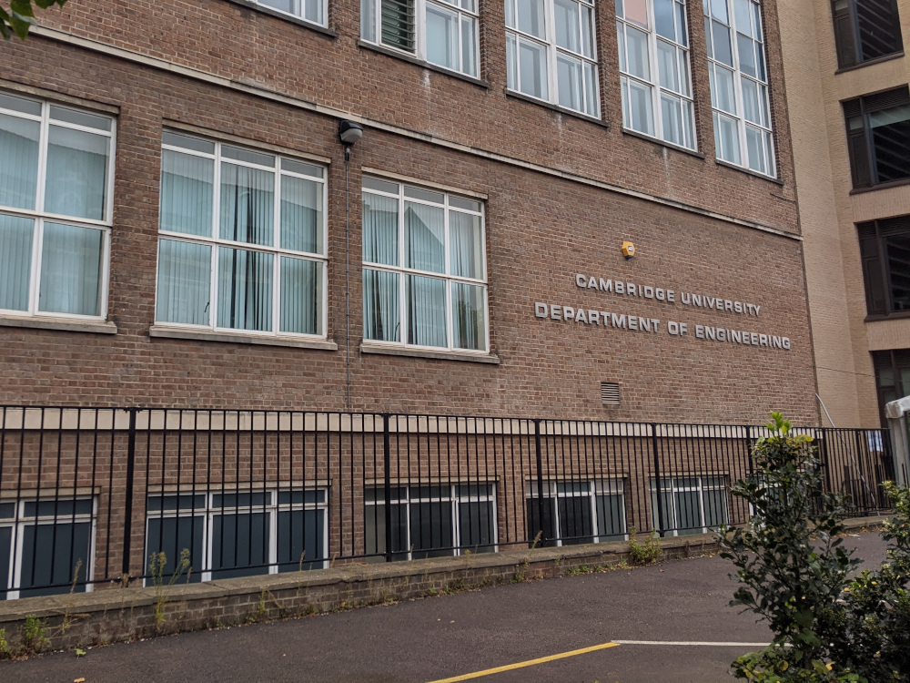

{: .image-left }

Welcome to my personal web-page. Here you can find information about me, and the projects I have been working on during my post-graduate studies.

# Latest news
- The list of talks [FEniCS 2021](https://fenics2021.com/) is now available. 
- New preprint of [Construction of arbitrary order finite element degree-of-freedom maps on polygonal and polyhedral cell meshes](papers.md#scroggs2021dofs) available on [arxiv](https://arxiv.org/abs/2102.11901).
- An initial version of the [dolfinx tutorial](https://jorgensd.github.io/dolfinx-tutorial/) is available online. 
- The [Pygmsh tutorial](converted_files/tutorial_pygmsh.md)  has been updated to use the latest release.
- A tutorial for usage of of the GMSH API has been added to the [Tutorial pages](converted_files/tutorial_gmsh.md).
- Simple Taylor-Green solver and [3D Turek benchmark](http://www.featflow.de/en/benchmarks/cfdbenchmarking/flow/dfg_flow3d.html) IPCS Navier-Stokes solver for [dolfinx](https://github.com/FEniCS/dolfinx/) is available at [jorgensd/dokken_ipcs](https://github.com/jorgensd/dolfinx_ipcs) on Github!

 

# About me

{: .image-right }

I am currently a Postdoctoral Research Associate at the University of Cambridge, working on the ASiMoV project, working with [Chris Richardson](http://www.bpi.cam.ac.uk/user/chris) and [Garth Wells](http://www3.eng.cam.ac.uk/~gnw20/) on the [ASiMoV](https://gow.epsrc.ukri.org/NGBOViewGrant.aspx?GrantRef=EP/S005072/1)-project. The main goal of this projecct is to do the worlds first, high fidelity simulation of a complete gas-turbine engine during operation, simultaneously including the effects of thermo-mechanics, electromagnetics, and CFD.

 

## Software
I am involved in the development of the following software:
{: .image-right }
- [dolfinx](https://github.com/FEniCS/dolfinx) - The next generation FEniCS problem solving environment
  - [Construction of arbitrary order finite element degree-of-freedom maps on polygonal and polyhedral cell meshes](papers.md#scroggs2021dofs)
- [dolfinx_mpc](https://github.com/jorgensd/dolfinx_mpc)- An extension to Dolfin-X supporting multi-point constraints (such as contact and slip conditions)
- [The FEniCS project](https://bitbucket.org/fenics-project/) - An open-source computing platform for solving partial differential equations using the finite element method. My main focus in this software was the multimesh finite element method, resulting in the following papers:
  - [A multimesh finite element method for the Navier--Stokes equations based on projection methods](papers.md#dokken2020navier)
  - [Shape Optimization Using the Finite Element Method on Multiple Meshes with Nitsche Coupling](papers.md#dokken2019shape)
- [dolfin-adjoint](http://www.dolfin-adjoint.org/en/latest/) - An algorithmic differentiation tool using
    [pyadjoint](https://github.com/dolfin-adjoint/pyadjoint) to differentiate FEM models written in [Dolfin](https://bitbucket.org/fenics-project/dolfin/src/master/) and [Firedrake](https://www.firedrakeproject.org/). The contributions here have resulted in one published paper and one preprint
    - [Automatic shape derivatives for transient PDEs in FEniCS and Firedrake](papers.md#dokken2020shape)
    - [dolfin-adjoint 2018.1: automated adjoints for FEniCS and Firedrake](papers.md#mitusch2019pyadjoint)
