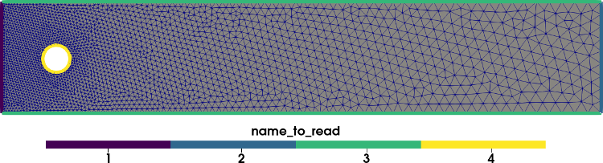

---
jupyter:
  jupytext:
    formats: ipynb,py:light,md
    text_representation:
      extension: .md
      format_name: markdown
      format_version: '1.3'
      jupytext_version: 1.16.2
  kernelspec:
    display_name: Python 3 (ipykernel)
    language: python
    name: python3
---

# Mesh generation and conversion with GMSH and PYGMSH

<!-- #region -->
In this tutorial, you will learn:
1. [How to create a mesh with mesh markers in pygmsh](#first)
2. [How to convert your mesh to XDMF](#second)
3. [How to create 3D meshes with pygmsh](#third)

This tutorial can be downloaded as a [Python-file](pygmsh_tutorial.py) or as a [Jupyter notebook](pygmsh_tutorial.ipynb)

Prerequisites for this tutorial is to install [pygmsh](https://pypi.org/project/pygmsh), [meshio](https://pypi.org/project/meshio) and [gmsh](https://gmsh.info/bin/Linux/gmsh-4.11.1-Linux64.tgz). All of these dependencies can be found in the docker image
`ghcr.io/jorgensd/jorgensd.github.io:main`, which can be ran on any computer with docker using

```bash
docker run -v $(pwd):/root/shared -ti -w "/root/shared" --rm ghcr.io/jorgensd/jorgensd.github.io:main
```

## <a name="first"></a> 1. How to create a mesh with pygmsh
In this tutorial, we will learn how to create a channel with a circular obstacle, as used in the [DFG-2D 2 Turek benchmark](http://www.featflow.de/en/benchmarks/cfdbenchmarking/flow/dfg_benchmark2_re100.html).

To do this, we use pygmsh.
First we create an empty geometry and the circular obstacle:
<!-- #endregion -->

```python
import meshio
import gmsh
import pygmsh

resolution = 0.01
# Channel parameters
L = 2.2
H = 0.41
c = [0.2, 0.2, 0]
r = 0.05

# Initialize empty geometry using the build in kernel in GMSH
geometry = pygmsh.geo.Geometry()
# Fetch model we would like to add data to
model = geometry.__enter__()
# Add circle
circle = model.add_circle(c, r, mesh_size=resolution)
```

The next step is to create the channel with the circle as a hole.

```python
# Add points with finer resolution on left side
points = [
    model.add_point((0, 0, 0), mesh_size=resolution),
    model.add_point((L, 0, 0), mesh_size=5 * resolution),
    model.add_point((L, H, 0), mesh_size=5 * resolution),
    model.add_point((0, H, 0), mesh_size=resolution),
]

# Add lines between all points creating the rectangle
channel_lines = [
    model.add_line(points[i], points[i + 1]) for i in range(-1, len(points) - 1)
]

# Create a line loop and plane surface for meshing
channel_loop = model.add_curve_loop(channel_lines)
plane_surface = model.add_plane_surface(channel_loop, holes=[circle.curve_loop])

# Call gmsh kernel before add physical entities
model.synchronize()
```

The final step before mesh generation is to mark the different boundaries and the volume mesh. Note that with pygmsh, boundaries with the same tag has to be added simultaneously. In this example this means that we have to add the top and
 bottom wall in one function call.

```python
volume_marker = 6
model.add_physical([plane_surface], "Volume")
model.add_physical([channel_lines[0]], "Inflow")
model.add_physical([channel_lines[2]], "Outflow")
model.add_physical([channel_lines[1], channel_lines[3]], "Walls")
model.add_physical(circle.curve_loop.curves, "Obstacle")
```

We generate the mesh using the pygmsh function `generate_mesh`. Generate mesh returns a `meshio.Mesh`. However, this mesh is tricky to extract physical tags from. Therefore we write the mesh to file using the `gmsh.write` function.

```python
geometry.generate_mesh(dim=2)
gmsh.write("mesh.msh")
gmsh.clear()
geometry.__exit__()
```

## <a name="second"></a>2. How to convert your mesh to XDMF
Now that we have save the mesh to a `msh` file, we would like to convert it to a format that interfaces with DOLFIN and DOLFINx.
For this I suggest using the `XDMF`-format as it supports parallel IO.

```python
mesh_from_file = meshio.read("mesh.msh")
```

Now that we have loaded the mesh, we need to extract the cells and physical data. We need to create a separate file for the facets (lines), which we will use when we define boundary conditions in DOLFIN/DOLFINx. We do this with the following convenience function. Note that as we would like a 2 dimensional mesh, we need to remove the z-values in the mesh coordinates.


```python
def create_mesh(mesh, cell_type, prune_z=False):
    cells = mesh.get_cells_type(cell_type)
    cell_data = mesh.get_cell_data("gmsh:physical", cell_type)
    points = mesh.points[:, :2] if prune_z else mesh.points
    out_mesh = meshio.Mesh(
        points=points, cells={cell_type: cells}, cell_data={"name_to_read": [cell_data]}
    )
    return out_mesh
```

With this function at hand, we can save the meshes to `XDMF`.

```python
line_mesh = create_mesh(mesh_from_file, "line", prune_z=True)
meshio.write("facet_mesh.xdmf", line_mesh)

triangle_mesh = create_mesh(mesh_from_file, "triangle", prune_z=True)
meshio.write("mesh.xdmf", triangle_mesh)
```

## <a name="third"></a>3. How to create a 3D mesh using pygmsh
To create more advanced meshes, such as 3D geometries, using the OpenCASCADE geometry kernel is recommended.
We start by importing this kernel, and creating three objects:
- A box $[0,0,0]\times[1,1,1]$
- A box $[0.5,0.0.5,1]\times[1,1,2]$
- A ball from $[0.5,0.5,0.5]$ with radius $0.25$.

```python
# Clear previous model
mesh_size = 0.1
geom = pygmsh.occ.Geometry()
model3D = geom.__enter__()
box0 = model3D.add_box([0.0, 0, 0], [1, 1, 1])
box1 = model3D.add_box([0.5, 0.5, 1], [0.5, 0.5, 1])
ball = model3D.add_ball([0.5, 0.5, 0.5], 0.25)
```

In this demo, we would like to make a mesh that is the union of these three objects.
In addition, we would like the internal boundary of the sphere to be preserved in the final mesh.
We will do this by using boolean operations. First we make a `boolean_union` of the two boxes (whose internal boundaries will not be preserved). Then, we use boolean fragments to perserve the outer boundary of the sphere.

```python
union = model3D.boolean_union([box0, box1])
union_minus_ball = model3D.boolean_fragments(union, ball)
model3D.synchronize()
```

To create physical markers for the two regions, we use the `add_physical` function. This function only works nicely if the domain whose boundary should be preserved (the sphere) is fully embedded in the other domain (the union of boxes). For more complex operations, it is recommened to do the tagging of entities in the gmsh GUI, as explained in the [GMSH tutorial](tutorial_gmsh.md).

```python
model3D.add_physical(union, "Union")
model3D.add_physical(union_minus_ball, "Union minus ball")
```

We finally generate the 3D mesh, and save both the geo and  msh file as in the previous example.

```python
geom.generate_mesh(dim=3)
gmsh.write("mesh3D.msh")
model3D.__exit__()
```

These XDMF-files  can be visualized in Paraview and looks like



We use the same strategy for the 3D mesh as the 2D mesh.
